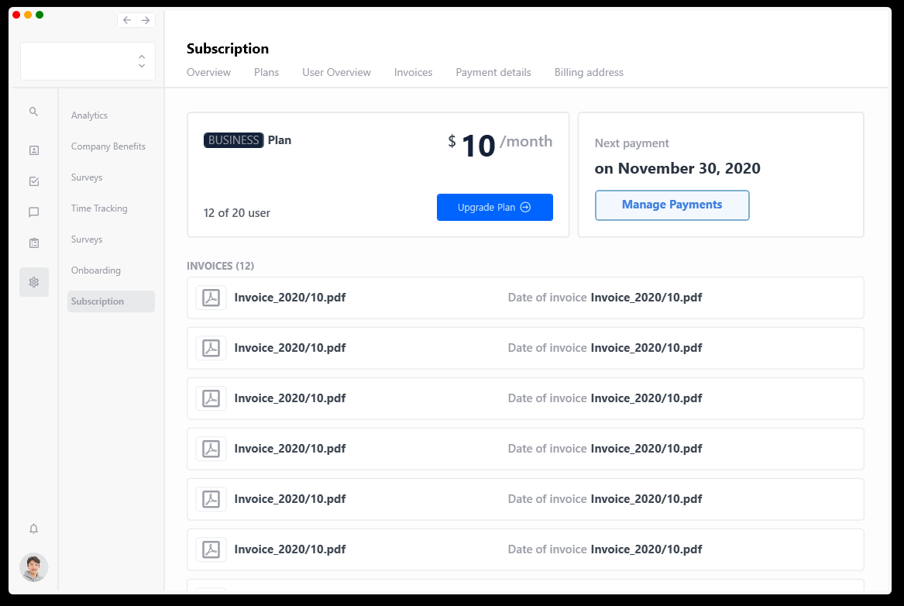

# Subscription Demo Application

This project is written with reference great design sample from [Dribbble](https://dribbble.com/shots/14428654-Subscription-and-Plan-Overview).

 

# Build/Run

**Requirements**

- [Visual Studio](https://visualstudio.microsoft.com/)
- [WPF](https://docs.microsoft.com/en-us/dotnet/desktop/wpf/getting-started/?view=netframeworkdesktop-4.8&viewFallbackFrom=netdesktop-5.0)
- [.Net5](https://dotnet.microsoft.com/download/dotnet/5.0)

**Run the app**

- Open the solution file in Visual Studio.
- Restore the nuget packages.
- Build and run the app.

# To do list

- Implement dynamically changing banner resources.
- Add interface which enable to download pdf file into InvoiceCard.
- Improve SubMenus's effect on Subscription page.
- Implement progress bar on BusinessCard.
- Improve button event animation.

## Reference

[Design Reference](https://dribbble.com/shots/14428654-Subscription-and-Plan-Overview)